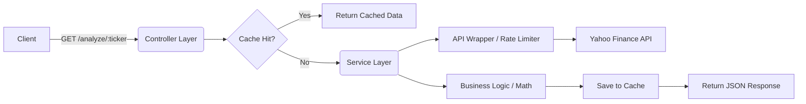

# 📈 Financial Fundamental Analysis API

   

A high-performance, type-safe REST API that aggregates real-time stock market data to perform fundamental analysis (e.g., P/E Ratio, EPS). Built with a focus on **clean architecture**, **mathematical precision**, and **scalability**.

## 🚀 Features

- **Real-Time Data:** Fetches live market data using Yahoo Finance (v3).
- **Smart Caching:** In-memory caching layer (TTL: 10 mins) to reduce latency from ~800ms to **<5ms**.
- **Precise Math:** Uses `decimal.js` to eliminate floating-point arithmetic errors common in financial software.
- **Rate Limiting:** `Bottleneck` implementation prevents upstream API bans by throttling requests.
- **Qualitative Analysis:** Automatically tags stocks as "Undervalued", "Fair Value", or "Overvalued" based on P/E thresholds.
- **Resilient Error Handling:** Gracefully handles missing financial data (e.g., unprofitable companies) without crashing.

---

## 🏗️ Architecture

This project follows a **Layered Architecture** (Controller-Service-Repository pattern) to ensure separation of concerns and testability.



### Core Components

- **Controllers (`src/controllers`):** Handle HTTP requests, input validation, and status codes.
- **Services (`src/services`):** Contain pure business logic (P/E calculation, data normalization).
- **Utils (`src/utils`):** Manage external dependencies (Yahoo Finance) and infrastructure logic (Rate limiting).

---

## 🛠️ Tech Stack

- **Runtime:** Node.js (LTS)
- **Language:** TypeScript (Strict Mode enabled)
- **Framework:** Express.js
- **Key Libraries:**
  - `yahoo-finance2`: Data Source (v3 implementation)
  - `decimal.js`: Arbitrary-precision arithmetic
  - `node-cache`: In-memory caching
  - `bottleneck`: Task scheduling/Throttling

---

## 📂 Project Structure

```text
financial-analyzer-api/
├── src/
│   ├── config/         # Environment variables & configuration
│   ├── controllers/    # Request handlers (Input Validation)
│   ├── routes/         # API Endpoint definitions
│   ├── services/       # Business Logic (Calculations, Caching)
│   ├── types/          # TypeScript Interfaces (Data Contracts)
│   ├── utils/          # External API Wrappers & Rate Limiters
│   ├── app.ts          # App setup (Middleware)
│   └── server.ts       # Entry point
├── dist/               # Compiled JavaScript (Production)
└── .env                # Secret keys (Not committed)
```

---

## ⚡ Getting Started

### Prerequisites

- Node.js (v18 or higher)
- npm

### Installation

1.  **Clone the repository**

    ```bash
    git clone [https://github.com/yourusername/financial-analysis-api.git](https://github.com/yourusername/financial-analysis-api.git)
    cd financial-analysis-api
    ```

2.  **Install dependencies**

    ```bash
    npm install
    ```

3.  **Configure Environment**
    Create a `.env` file in the root directory:

    ```env
    PORT=3000
    NODE_ENV=development
    ```

4.  **Run the Server**

    ```bash
    # Development mode (restarts on save)
    npm run dev

    # Production build
    npm run build
    npm start
    ```

---

## 📡 API Endpoints

### 1. Analyze Stock

Returns fundamental indicators and qualitative analysis for a given ticker.

- **URL:** `/api/stocks/analyze/:ticker`
- **Method:** `GET`
- **Example:** `http://localhost:3000/api/stocks/analyze/AAPL`

**Success Response (200 OK):**

```json
{
  "ticker": "AAPL",
  "currency": "USD",
  "price": "225.50",
  "analysis": "Fair Value Range",
  "indicators": {
    "pe_ratio": "28.50",
    "eps": "7.91",
    "pb_ratio": "45.12"
  },
  "generated_at": "2024-12-14T10:00:00.000Z"
}
```

**Error Response (404 Not Found):**

```json
{
  "error": "Stock ticker 'INVALID' not found."
}
```

---

## 🧠 Design Decisions (The "Why")

1.  **Why TypeScript?**
    Financial data is often messy (nulls, undefined values). TypeScript's strict null checks prevent runtime crashes by forcing us to handle missing data explicitly at compile time.

2.  **Why Decimal.js?**
    Native JavaScript numbers are floating-point (`0.1 + 0.2 !== 0.3`). In finance, rounding errors are unacceptable. `decimal.js` ensures that `$19.99` remains `$19.99` during calculations.

3.  **Why Bottleneck?**
    External APIs have rate limits. Instead of spamming requests and getting banned, we use a queue system to ensure we comply with Yahoo Finance's usage policies automatically.

4.  **Why Layered Architecture?**
    Separating `Controllers` from `Services` allows us to test business logic (math) without spinning up an HTTP server. It also allows us to swap the API provider (Yahoo) without rewriting the Controller logic.

---

## 📝 Roadmap

- [x] Basic P/E Analysis
- [x] Caching & Rate Limiting
- [x] TypeScript Migration
- [ ] Unit Tests (Jest)
- [ ] Docker Containerization
- [ ] Comparison Endpoint (Compare multiple stocks)

## 📄 License

This project is licensed under the MIT License - see the LICENSE file for details.
